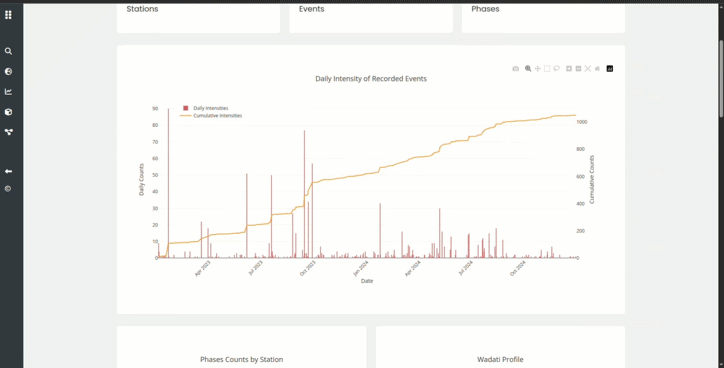

# Microearthquake Monitoring Data Analysis Dashboard

<div align='center'>
    
</div>

## Overview

The **Microearthquake Monitoring Data Analysis Dashboard** is a web application built with **Django** designed specifically for internal development and operational use. This dashboard allows for the analysis and visualization of microearthquake data stored in a PostgreSQL database. Utilizing **Plotly**, it provides interactive visualizations including various plotting capabilities for efficient data exploration.

---

## Features

- Interactive visualizations of microearthquake events.
- Integration with a PostgreSQL/PostGIS database for effective geographical data handling.
- Automated data querying and processing using Django ORM, Pandas and NumPy.
- Vanilla JavaScript (fetch API) front-end interactions for real-time data updates and analysis.
- User-friendly interface for managing and navigating through data analysis tasks.
- Dynamic data filtering and downloading (microearthquake catalog).

---

## Getting Started

If you'd like to test this app using **Docker** on your local machine, the following instructions will help you set it up and run it locally.

Please note that, due to data confidentiality policies, the database contents are not included—so the app will appear blank.

If you're interested in the database structure, feel free to contact me via email at [edelo.arham@gmail.com](mailto:edelo.arham@gmail.com).

### Prerequisites

Ensure you have the following installed:

- **Docker**: For containerization.
- **Docker Compose**: For managing multi-container Docker applications.

### Cloning the Repository

Clone the repository to your local machine:

```bash
git clone https://github.com/yourusername/microearthquake-dashboard.git
cd microearthquake-dashboard
```

### Running the Application

1. **Setup Environment Variables**: Create a `.env` file and configure the necessary variables (check webapp/settings.py):
    ```env
    DB_URL=postgres://yourusername:yourpassword@db:5432/yourdbname
    MAPBOX_API_TOKEN=your_mapbox_token
    ```

2. **Building and Running Docker Containers**:
   ```bash
   docker-compose up --build
   ```

3. **Access the Dashboard**: Open your browser and go to [http://localhost:8000](http://localhost:8000). 

---

## Project Structure

```plaintext
microearthquake-dashboard/
│
├── .dockerignore               # Docker ignore file
├── .gitignore                  # Git ignore file
├── Dockerfile                  # Dockerfile for building the app
├── Dockerfile.nginx            # Dockerfile for Nginx server
├── docker-compose.yml          # Docker Compose file
├── entrypoint.prod.sh          # Production entrypoint script
├── manage.py                   # Django management utility
├── requirements.txt            # Python dependencies
│
├── frontpage/                  # Frontpage application
│   ├── __init__.py
│   ├── admin.py
│   ├── apps.py
│   ├── models.py
│   ├── views.py
│   ├── urls.py
│   ├── migrations/
│   │   ├── ...
│   └── templates/
│       └── frontpage/
│           ├── base.html
│           └── ...
│
└── project/                    # Backend application
    ├── __init__.py
    ├── admin.py
    ├── apps.py
    ├── models.py
    ├── views.py
    ├── urls.py
    ├── utils.py
    ├── filters.py
    ├── migrations/
    │   ├── ...
    └── templates/
        └── project/
            ├── base-project.html
            └── ...
```

---

## Future Improvements

### Enhancements in Automatic Hypocenter Processing

Future improvements are focused on developing advanced backend data engine functionalities to enable:

- **Automatic Hypocenter Determination**: Implement algorithms that can automatically identify hypocenter locations from seismic data.
- **Hypocenter Relocation Methods**: Improve existing methodologies for relocating hypocenters based on improved data input and processing techniques.
- **Moment Magnitude Calculations**: Enable automatic computation of moment magnitudes for detected seismic events.
- **Post Data Analytics**: Incorporate analytical methods such as **Gutenberg-Richter analysis** to better understand the distribution and frequency of seismic events.

These enhancements will make the application more robust for internal development, streamline workflows, and provide more accurate analyses of seismic data in microearthquake monitoring.

---

## Contributing

If you're interested in contributing to the project:

1. Fork the repository.
2. Make your changes.
3. Create a pull request detailing your changes and the problem it resolves.

---

## License

This project is licensed under the MIT License - see the [LICENSE](LICENSE) file for details.

---

## Acknowledgments

- **Django**: For the robust web framework.
- **PostgreSQL/PostGIS**: For database/handling geographical data.
- **Plotly**: For rich interactive data visualizations.
- **Docker**: For containerizing the application.
- **DigitalOcean Droplets**: For deployment.

For more information on project usage, please refer to the codebase or contact the project maintainers to [edelo.arham@gmail.com](mailto:edelo.arham@gmail.com).
